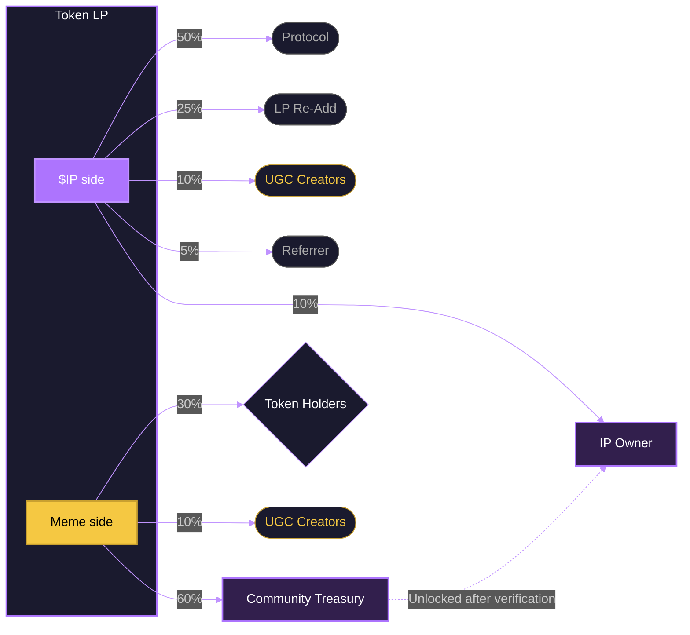

**ip.world** turns internet culture into on-chain markets. A meme, a creator, a character, a movement — anything can become a **Trend**. Every Trend can have a **Token**. Every trade on that token generates fees that flow back to the people who made the culture worth trading.

That's the whole idea. We call it **culture markets**.

<Frame>
  
</Frame>

## How it works

<CardGroup cols={3}>
  <Card title="Trends and Tokens" icon="fire">
    A **Trend** is the canonical page for an idea. A **Token** is the tradable market under it. Launch one, trade one, or govern one.
  </Card>
  <Card title="Fees go back to culture" icon="circle-dollar-to-slot">
    Trading fees split four ways: creator rewards, holder rewards, community treasury, and the protocol. Hold a token. Post about it. Earn from both.
  </Card>
  <Card title="Community treasury" icon="vault">
    Every token has a treasury funded by its own trading volume. Holders vote on how to use it. The market governs itself.
  </Card>
</CardGroup>

### Fee flow per token

Every token's LP holds two assets — **$IP** and the **Meme token**. Each side generates fees that split differently.

<Tip>
  One Trend can have **multiple tokens** — each with its own LP, fee splits, holders, and UGC pool. The IP Owner and Community Treasury sit at the Trend level, shared across all tokens under it.
</Tip>

## Two chains. Three assets.

ip.world runs on **Story** and **Solana**. Trade with **IP**, **USDC**, or **SOL**. Bring your own wallet or use the embedded ones provisioned at sign-in.

## Start here

<CardGroup cols={2}>
  <Card title="Quickstart" icon="rocket" href="/user-guides/getting-started">
    Sign in, fund your account, and make your first trade in under five minutes.
  </Card>
  <Card title="Trends and tokens" icon="lightbulb" href="/user-guides/coin-types">
    The two types of markets — creator-type and community-type — and how they differ.
  </Card>
  <Card title="Rewards" icon="trophy" href="/user-guides/rewards/overview">
    Five separate programs: points, referrals, UGC, holder rewards, and treasury. Don't mix them up.
  </Card>
  <Card title="Launch a coin" icon="plus" href="/user-guides/how-to/launch-a-coin">
    Create your own Trend and Token from scratch.
  </Card>
</CardGroup>

<Info>
  **Community:** [Discord](https://discord.gg/ipworld) — live help, announcements, and the people actually using this.
</Info>
